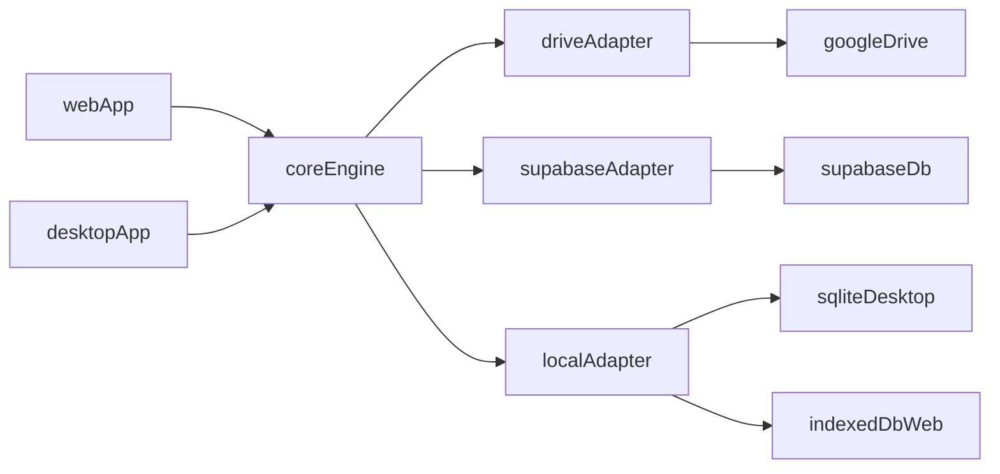

# Architecture

## Overview

Lumio is built as a TypeScript monorepo where business rules and sync logic are shared across:
- `apps/web` (browser shell)
- `apps/desktop` (Tauri shell)

Files live in user-owned Google Drive. Metadata/progress/folder state live in Supabase Postgres with RLS. Desktop keeps an offline SQLite mirror plus file cache.

## Components

### `packages/core`
- Domain models (`Book`, `Folder`, `Progress`)
- Sync engine and conflict resolution
- Offline queue and retry behavior
- Adapter interfaces to isolate platform/cloud details

### `packages/adapters`
- Google Drive API adapter (folders, resumable upload, download)
- Supabase adapter (metadata/progress/folder sync)
- Local storage adapters (IndexedDB, SQLite)

### `packages/ui`
- Shared library and reader UI primitives
- Sync state badges and interaction components

### `apps/web`
- Next.js app router shell
- Auth callback and session bootstrapping
- Browser-local metadata cache via IndexedDB

### `apps/desktop`
- Tauri shell with native capabilities
- Local file cache and background sync worker
- Secure local token storage

### `infra/supabase`
- SQL migrations
- RLS policies and indexes
- Schema docs and verification scripts

## Data Ownership

- **Book files:** Google Drive only
- **Cloud metadata/progress:** Supabase Postgres
- **Desktop local metadata/progress:** SQLite
- **Web local metadata/progress:** IndexedDB
- **Desktop file cache:** local filesystem under app data

## Data Flow

## Sync Lifecycle (V1)

1. Pull cloud updates since `last_sync_at`
2. Merge into local store with deterministic LWW conflict policy
3. Push pending mutations (`progress`, `folder moves`, `imports`)
4. Flush upload/download queues
5. Persist new `last_sync_at` and item statuses

## Conflict Resolution

- Progress conflicts: LWW by `version`, tie-break by `device_id`
- Folder/book metadata conflicts: LWW by `updated_at`
- Queue dedupe: keep latest progress mutation per `book_id`

## Security Boundaries

- Google OAuth tokens are never committed or logged
- Desktop secrets are persisted in encrypted stronghold storage
- Supabase tables use RLS with `auth.uid()`-scoped access
- No book content is stored on Lumio servers
